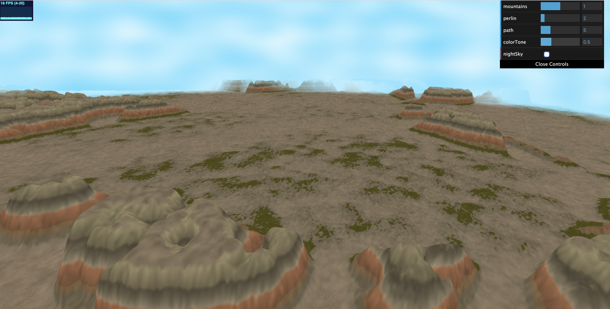

# Noisy terrain

Spring 2020  
Iciar Andreu Angulo  
PennKey: iciar  
***Link to demo***: https://iciara.github.io/noisy-terrain/

## Main Features
The terrain in this project is the combination of two different random calculations - mountains and flat ground, which are combined using a wide fbm to be able to generate large areas of moutains followed by large areas of flat ground.
- **Mountains**: the paths along the mountains are created using Perlin Noise, and the mountains themselves using fbm. Smoothstep is used to make the tops of the mountains flatter and to generate a sharper transition from the path to the mountains.
- **Flat Ground**: also a combination of Perlin noise and fbm, but this time the fbm is flatter to create a roughness in the ground and areas of grass.
- **Color**: Color is generated based on height, with clear distinction areas of color at different heights for the mountains. Double warped fbm is used to create roughness in the color to make it more realistic, in addition to regular fbm to create the randomness in the transitions of colors, so it is not a flat line. A pure random function is used on the flatter ground to create the illusion of sand. The transitions between different colors are done in a smoother way by interpolating between colors during the transition.

## GUI Features
- **Mountains**: Change the plain areas to become a mountain area and vice versa.  
Default value (mountains = 1.0):

Filled plains with mountains (mountains = 0.0):

Lowering the mountain area (mountains = 1.7):

Lower the mountain area completely so that everything is flat (mountains = 2.0):

- **Perlin**: Modify some of the Perlin noise properties to increase or decrease the separation paths between the mountains and the grass areas in the flat sections.  
Default value (perlin = 2.0):

Small value creates more separation (perlin = 0.5):

High value creates more compact mountains and grass (perlin = 14):

- **Path**: Similar to the Perlin value above since it also modifies the wideness of the paths made using Perlin noise but this value only affects the mountain areas.  
Default value (path = 5.0):

Smaller value creates more separation (path = 2.5):

A very small value will reduce all the moutains (path = 1.0):

High value creates more compact mountains and sharp distinction of the path (path = 12):

- **Color Tone**: Modifies the overall color of the scene to give it a brighter or darker look.  
Default value (colorTone = 1.0):

A smaller value darkens the look (colorTone = 0.5):

A high value makes everything brighter (colorTone = 1.2):

- **Night Sky**: Changes the sky between day and night.  
Night sky look full of stars, with a lower value for the color tone as well to make it more realistic (nightSky = true, colorTone = 0.5):

## Build Instructions
To build the project you need to install Node.js and then run 'npm install' and then 'npm start'.

## Resources
- https://workshop.chromeexperiments.com/examples/gui/#1--Basic-Usage
- http://iquilezles.org/www/articles/morenoise/morenoise.htm
- http://iquilezles.org/www/articles/gradientnoise/gradientnoise.htm
- https://thebookofshaders.com/12/
- https://www.redblobgames.com/maps/terrain-from-noise/
- http://web.mit.edu/cesium/Public/terrain.pdf
- http://iquilezles.org/www/articles/warp/warp.htm
